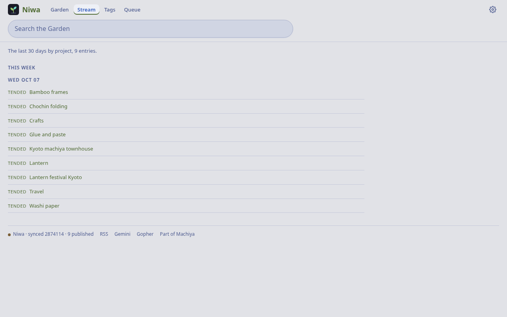

# Niwa

[Machiya](https://github.com/machiya-kobo/machiya) is a set of small self-hosted apps for finding what you've read: your pages ([Hister](https://github.com/asciimoo/hister)), the web ([SearXNG](https://github.com/searxng/searxng)), your notes ([Obsidian](https://obsidian.md)) and your code ([Forgejo](https://forgejo.org) or [GitHub](https://github.com)).

Niwa (庭, "garden") is the digital garden for Machiya and publishes the notes you choose from your Obsidian vault to the Web. It's also a Gemini capsule and a Gopher hole.

<p align="center">
<a href="https://machiya-kobo.github.io/machiya/">Machiya</a> · <a href="#grow-your-garden">Features</a> · <a href="#quickstart">Quickstart</a> · <a href="#who-can-use-it">Access</a> · <a href="#in-a-container">Containers</a> · <a href="#natively-on-the-bsds">BSDs</a> · <a href="#install">Install</a> · <a href="#settings">Settings</a> · <a href="#api">API</a> · <a href="#license">License</a>
</p>

<p align="center"><a href="docs/screenshots/niwa-garden-dark.png"></a><br>Wander the garden</p>
<table>
  <tr>
    <td align="center" width="33%"><a href="docs/screenshots/niwa-note-light.png"></a><br>Tend a note</td>
    <td align="center" width="33%"><a href="docs/screenshots/niwa-queue-dark.png"></a><br>Pick what to publish</td>
    <td align="center" width="33%"><a href="docs/screenshots/niwa-stream-light.png"></a><br>See what changed</td>
  </tr>
</table>
<p align="center"><a href="docs/screenshots/niwa-note-phone-light.png"></a><br>Read it on your phone</p>

## Grow your garden

- Publish with one button. Niwa adds `publish: true` to the note's frontmatter and touches nothing else.
- Growth stages (seedling, budding, evergreen), confidence, pins, backlinks, nearby notes and topic maps.
- A queue of notes worth sharing: your agents' suggestions and your most-linked notes come first.
- A stream of what changed, an RSS feed, search and a random note.

## Keep your secrets

- Every publish is scanned first: LAN and tailnet addresses, MAC addresses, keys, tokens, tailnet names, email addresses, and any words you list in `NIWA_SCAN_DENY`.
- A note with an error stays out of the garden until you press "Publish anyway", even if `publish: true` came from somewhere else.
- Notes in private folders (`NIWA_PRIVATE_FOLDERS`) never publish.

## Keep your links

- Niwa checks every link in a published note and saves a copy at the Wayback Machine. A live link gets a small "archive.org" link beside it; a dead one points at the copy.
- That sends your published notes' links to archive.org. `NIWA_ARCHIVE=none` turns it off.
- With Hister, your own pages show your private copy too.

## Meet your audience where they are

- Niwa publishes to the Web, Gemini and Gopher. Gopher, for visitors still on the Information Superhighway.
- The public website is optional and off by default (`NIWA_PUBLIC_PORT`): published notes only, no sign-in, no cookies.

## Quickstart

Run Niwa on your own machine with the sample vault: a paper-lantern workshop and a trip to Kyoto, nine notes in the
garden. No account, no Tailscale. These commands are for Debian or Ubuntu; other systems and containers are under
[More ways to run it](#more-ways-to-run-it).

**1. Install** Python 3 with venv, `git` and `openssl` (for the Gemini certificate), plus `curl` and `nc` for the
checks:

<!-- quickstart: packages-debian -->
```bash
sudo apt-get update && sudo apt-get install -y python3-venv git openssl curl netcat-openbsd
```

**2. Clone Niwa** and put `markdown` 3.11 or later and `pyyaml` into a venv in it:

```sh
git clone https://github.com/machiya-kobo/niwa.git && cd niwa
```

<!-- quickstart: venv -->
```bash
python3 -m venv .venv && .venv/bin/pip install -q 'markdown>=3.11' pyyaml
```

**3. Make the sample vault a git repository.** Niwa pushes what you publish, so it needs a repository it can push to:
here a local bare one, `demo-vault.git`, made from `sample-vault/` (its notes are in `personal/`):

<!-- quickstart: vault -->
```bash
tools/demo-vault demo-vault --bare
mkdir -p demo-data
```

**4. Start it** on `127.0.0.1` with the identity check off (`NIWA_AUTH=open`, for your own machine only):

<!-- quickstart: native-run-debian background -->
```bash
NIWA_AUTH=open NIWA_BIND=127.0.0.1 NIWA_HOST=localhost NIWA_REPO_SUBDIR=personal \
  NIWA_REPO_URL="file://$PWD/demo-vault.git" NIWA_REPO_DIR="$PWD/demo-data/repo" \
  NIWA_DB="$PWD/demo-data/niwa.sqlite3" .venv/bin/python app/niwa.py
```

**5. Open <http://127.0.0.1:8080/>.** Publish a note and Niwa commits it to `demo-vault.git` about two minutes after
your last change (`git -C demo-vault.git log`). Gemini is on port 1965, Gopher on 7070. Ctrl-C stops it;
`rm -rf demo-vault demo-vault.git demo-data` cleans up.

`tools/quickstart-test` runs these steps (and the container and BSD ones below) from a fresh clone and checks the output.

## Who can use it

Here the **owner** is the person whose vault it is, and a **room** is one Machiya app (Niwa is the garden).

- **You, on localhost:** `NIWA_AUTH=open` with `NIWA_BIND=127.0.0.1`, as in the Quickstart. No login: anyone who
  reaches the port can publish, so keep it on your own machine.
- **People on your tailnet:** bind `127.0.0.1`, put `tailscale serve` in front, and list their Tailscale logins in
  `NIWA_USERS` (`NIWA_AUTH=tailscale`, the default; `*` is anyone, unset is nobody).
- **People, agents and Shiori devices with their own sign-in:** Machiya's identity file.
  `python3 -m vaultkit.identity setup` prints the settings. See
  [Machiya's identity guide](https://github.com/machiya-kobo/machiya/blob/main/docs/identity.md) (Python 3.11 or newer).
- **Hister's users:** `NIWA_AUTH=hister` signs people in with their Hister account through Machiya's sign-in helper
  ([the guide](https://github.com/machiya-kobo/machiya/blob/main/docs/identity.md#hister-sign-in-authhister)). Only
  accounts in `NIWA_HISTER_USERS` get in. While sign-in is down, the owner's Tailscale login in `NIWA_USERS` gets in
  with a banner; a signed-out browser never does. Bind `127.0.0.1` behind `tailscale serve`, or set
  `NIWA_BIND_BEHIND_PROXY=1` in a sidecar: it refuses a public bind otherwise.
- **Anyone, on the public web (optional):** set `NIWA_PUBLIC_PORT` and `NIWA_GARDEN_URL`, and put a TLS proxy (Caddy,
  a Cloudflare Tunnel, Tailscale Funnel) in front of that port. It serves the published notes, their tags and images,
  the stream and the feed. No sign-in, queue, settings, writes or cookies, and nothing from Konbini, Kura or Hister.

Each mode's settings are under [Settings](#settings). `/api/status` is always open.

## How it uses the vault

Niwa keeps its own clone of your vault and pushes with an ssh deploy key. It writes only the garden's fields
(`publish`, `growth`, `confidence`, `garden_pin`) and its events (`.garden/events/*.jsonl`), never a note's body. It
batches your changes into one commit, rebases onto whatever changed meanwhile (a conflicting edit gets a three-way
frontmatter merge) and pushes. Its SQLite file holds link records and your "Publish anyway" acknowledgements: back it
up, or notes with scan errors are held back again.

Optional, and the garden works without them:
- **Konbini** adds board badges, "in bloom" and the board half of the stream.
- **Kura** adds links to the full note on your own pages.
- **Hister** adds private link copies and the stream's reading line.

## More ways to run it

Each starts with your system's packages (below) and a clone with the sample vault made a repository (Quickstart steps 2
and 3). **You need** `git`, `curl`, `openssl` and `nc`, plus `podman` 4 or `docker` 24 or newer for a container (the
build pulls its base images from the internet). Ports 8080 (web), 1965 (Gemini) and 7070 (Gopher) must be free.

### In a container

*Container with podman* (on Debian or Ubuntu, install it first):

<!-- quickstart: packages-podman-debian -->
```bash
sudo apt-get update && sudo apt-get install -y podman git curl openssl netcat-openbsd
```

<!-- quickstart: container-podman -->
```bash
podman build -q -t niwa-demo app
podman run -d --init --name niwa-demo --userns=keep-id \
  -p 127.0.0.1:8080:8080 -p 127.0.0.1:1965:1965 -p 127.0.0.1:7070:7070 \
  -v "$PWD/demo-data":/data -v "$PWD/demo-vault.git":"$PWD/demo-vault.git" \
  -e NIWA_AUTH=open -e NIWA_HOST=localhost -e NIWA_REPO_SUBDIR=personal \
  -e NIWA_REPO_URL="file://$PWD/demo-vault.git" niwa-demo
```

Rootless podman started over plain ssh (no systemd user session) needs `cgroup_manager = "cgroupfs"` under `[engine]` in
`~/.config/containers/containers.conf`; a desktop login does not.

*Container with docker* (it runs as your own user, so the mounted folders stay yours). On Debian or Ubuntu install docker first
and add yourself to its group (log in again afterwards, or run the next blocks with `sg docker -c '…'`):

<!-- quickstart: packages-docker-debian -->
```bash
sudo apt-get update && sudo apt-get install -y docker.io git curl openssl netcat-openbsd
sudo usermod -aG docker "$USER"
```

<!-- quickstart: container-docker -->
```bash
docker build -q -t niwa-demo app
docker run -d --init --name niwa-demo -u "$(id -u):$(id -g)" \
  -p 127.0.0.1:8080:8080 -p 127.0.0.1:1965:1965 -p 127.0.0.1:7070:7070 \
  -v "$PWD/demo-data":/data -v "$PWD/demo-vault.git":"$PWD/demo-vault.git" \
  -e NIWA_AUTH=open -e NIWA_HOST=localhost -e NIWA_REPO_SUBDIR=personal \
  -e NIWA_REPO_URL="file://$PWD/demo-vault.git" niwa-demo
```

### Natively on the BSDs

Packages for Python, PyYAML and git, then pip for `markdown` (vaultkit needs 3.11 or later; the BSD packages ship older ones), in a venv that keeps the packages. Run the install line for your system as root (OpenBSD has `doas` in base; on a fresh FreeBSD or NetBSD use `su -` first, or install `sudo` from packages), then the run block:

<!-- quickstart: packages-openbsd -->
```bash
doas pkg_add python%3 py3-yaml git curl
```

<!-- quickstart: packages-freebsd -->
```bash
sudo pkg install -y python312 py312-sqlite3 py312-pyyaml git-lite curl
sudo ln -sf /usr/local/bin/python3.12 /usr/local/bin/python3
```

<!-- quickstart: packages-netbsd -->
```bash
sudo env PKG_PATH="https://cdn.NetBSD.org/pub/pkgsrc/packages/NetBSD/$(uname -p)/$(uname -r | cut -d_ -f1)/All" \
  /usr/sbin/pkg_add python313 py313-yaml git-base curl
sudo ln -sf /usr/pkg/bin/python3.13 /usr/pkg/bin/python3
```

Then, in the clone, the venv (it keeps the packages' PyYAML and adds `markdown` 3.11 or later), the sample vault
(steps 2 and 3 of the Quickstart) and the run block:

<!-- quickstart: venv-bsd -->
```bash
python3 -m venv --system-site-packages .venv && .venv/bin/pip install -q 'markdown>=3.11'
```

<!-- quickstart: native-run-bsd background -->
```bash
NIWA_AUTH=open NIWA_BIND=127.0.0.1 NIWA_HOST=localhost NIWA_REPO_SUBDIR=personal \
  NIWA_REPO_URL="file://$PWD/demo-vault.git" NIWA_REPO_DIR="$PWD/demo-data/repo" \
  NIWA_DB="$PWD/demo-data/niwa.sqlite3" .venv/bin/python app/niwa.py
```

On FreeBSD and NetBSD the packages install `python3.12` or `python3.13`, so the install lines above also link it as
`python3` (OpenBSD's package already does). `docs/install/bsd.md` in
[machiya-kobo/machiya](https://github.com/machiya-kobo/machiya) is the full guide, with rc.d scripts and the env file.

### Check all three listeners

This checks all three listeners, whichever way Niwa runs (a native run: in a second terminal, same folder). It waits up
to four minutes while Niwa clones and indexes the vault:

<!-- quickstart: check -->
```bash
i=0; while [ $i -lt 240 ]; do curl -fs http://127.0.0.1:8080/api/status | grep -q '"ready": true' && break; i=$((i+1)); sleep 1; done
curl -s http://127.0.0.1:8080/api/status
curl -s http://127.0.0.1:8080/ | grep -o '<title>[^<]*'
curl -s http://127.0.0.1:8080/n/Projects/Lantern | grep -o '<title>[^<]*'
printf 'gemini://localhost/\r\n' | openssl s_client -connect 127.0.0.1:1965 -quiet -ign_eof 2>/dev/null | head -n 3
printf '\r\n' | nc -w 2 127.0.0.1 7070 | head -n 1
```

You should see:

<!-- quickstart-expect: check -->
```text
"published": 9
"ready": true
"error": null
<title>Niwa
<title>Lantern - Niwa
20 text/gemini
# Niwa
NIWA
```

Niwa has no read-only mode: a real vault needs a deploy key with write access (see [Install](#install)). Stop a
container with:

<!-- quickstart: stop-container-podman -->
```bash
podman rm -f niwa-demo
```

<!-- quickstart: stop-container-docker -->
```bash
docker rm -f niwa-demo
```
A native run stops with Ctrl-C. Then remove the demo files: `rm -rf demo-vault demo-vault.git demo-data`.

### As part of the Machiya stack

In the stack, Niwa shares the vault with the other apps and links to them. Start from
[machiya-kobo/machiya](https://github.com/machiya-kobo/machiya): its README has the stack's Quickstart, and
`compose/compose.yml` and `compose/mirror.yml` are the files. What changes for Niwa:

| Setting | In the stack |
|---|---|
| `NIWA_REPO_URL`, `NIWA_REPO_SUBDIR` | the same vault repository and folder as the other apps (a deploy key with write access; Kura only needs read access) |
| `NIWA_REPO_REFERENCE`, `NIWA_REPO_SPARSE` | the vault mirror's path, mounted read-only at the same absolute path, so Niwa borrows its objects instead of fetching a second copy; the folders to check out (`<notes folder>,.garden`) |
| `MACHIYA_COOKIE_DOMAIN`, `MACHIYA_ROOMS` | one cookie domain and the list of room URLs, so the Rooms menu and the theme settings are shared |
| `NIWA_KONBINI_URL`, `NIWA_KURA_URL` | the other rooms' addresses: Konbini adds board badges and its API feeds the owner's stream; Kura adds "View in Kura" links (both optional) |
| `NIWA_AUTH`, `NIWA_USERS`, `NIWA_BIND`, `MACHIYA_IDENTITY_FILE` | who may use it: see "Who can use it" |
| `NIWA_HISTER_URL`, `NIWA_HISTER_TOKEN_FILE`, `NIWA_AUTH=hister` … | the stack's Hister and its token; Hister's users as the sign-in through the stack's hister-login helper (see "Who can use it") |
| `NIWA_KONBINI_TOKEN_FILE` | Niwa's own token for its calls to Konbini: a room token for Konbini, or with the identity file an identity token (see Settings) |
| `NIWA_ENV_FILE` (or `--env-file`) | a file of `KEY=VALUE` settings, for a native install |
| `MACHIYA_SOURCE_URL` | the address of the source code, to show a "Source code" link as the AGPL asks of a networked service |

## Install

Niwa needs a git repository of your vault (Markdown notes with YAML frontmatter) that it can push to.

**Container** (Docker or Podman; the image runs as uid 1000 and keeps everything under `/data`):

```sh
docker build -t niwa app
# HOME is /data: the deploy key (with write access to the vault repo) and known_hosts go in niwa-data/.ssh/
mkdir -p niwa-data/.ssh && cp /path/to/deploy_key niwa-data/.ssh/id_ed25519
ssh-keyscan git.example.net > niwa-data/.ssh/known_hosts
chmod 700 niwa-data/.ssh && chmod 600 niwa-data/.ssh/id_ed25519 && chown -R 1000:1000 niwa-data
docker run -d --name niwa --init --user 1000:1000 \
  -p 127.0.0.1:8080:8080 -p 1965:1965 -p 70:7070 \
  -v "$PWD/niwa-data:/data" \
  -e NIWA_REPO_URL=ssh://git@git.example.net/you/vault.git \
  -e NIWA_REPO_SUBDIR=notes \
  -e NIWA_HOST=garden.example.net \
  -e NIWA_AUTH=open \
  niwa
```

`NIWA_AUTH=open` has no login, so the example keeps the web port on 127.0.0.1. Gemini and Gopher serve only published
notes, so their ports can face the world. For everything else, see [Who can use it](#who-can-use-it): the default
`tailscale` mode trusts the `Tailscale-User-Login` header that `tailscale serve` sets, and any proxy that sets it and
strips the client's own copy works too.

**Native:** Python 3 with `markdown` 3.11 or later (older ones can run out of memory under Python 3.13) and `pyyaml`,
plus `git`, `openssh` and `openssl`. From `app/`, run `python3 niwa.py`. Settings come from the environment, or a file
given with `--env-file PATH` or `NIWA_ENV_FILE` (the environment wins).

The web UI is on `NIWA_PORT` (8080), Gemini on 1965 and Gopher on 7070. Gopher menus point at port 70 on `NIWA_HOST`
(`NIWA_GOPHER_PUBLIC_PORT`), so map port 70 to 7070 as the example does (rootless Podman needs
`net.ipv4.ip_unprivileged_port_start=70` or lower).

### The Gemini certificate

On first start Niwa makes a self-signed certificate with `openssl` (EC P-256, ten years, for `NIWA_HOST` and its
first label) and keeps `gemini.crt` and `gemini.key` next to `NIWA_DB`. Gemini clients trust it on first use. It's
made once: after changing `NIWA_HOST`, delete both files and restart (clients will ask again). Back up the data
directory so the certificate survives rebuilds.

## Settings

| Env | Default | |
|---|---|---|
| `NIWA_REPO_URL` | — | vault repo to clone once (ssh for writes; set `GIT_SSH_COMMAND` for the key). Unset: use `NIWA_REPO_DIR` as it is |
| `NIWA_REPO_DIR` | `/data/repo` | the clone |
| `NIWA_REPO_SUBDIR` | — | the vault folder in the repo that holds the notes. Unset: the repo root |
| `NIWA_REPO_REFERENCE` | — | in the Machiya stack: the stack's vault mirror, mounted read-only at the same absolute path. Niwa borrows its objects, so its own clone keeps only its own commits. Unset: a full clone of its own |
| `NIWA_REPO_SPARSE` | — | with a reference: the paths to check out (cone), e.g. `notes,.garden,.board` (the notes, Niwa's events, older events from a shared board). Unset: everything |
| `NIWA_POLL` | `60` | seconds between pulls |
| `TZ` | `UTC` | the time zone for the stream's days and "this week" counts, e.g. `Europe/Berlin` |
| `NIWA_IGNORE_AUTHORS` | — | comma-separated git author names of bots that commit to the vault: their commits don't count as "tended" in the stream (Niwa's own `NIWA_GIT_NAME` is always ignored) |
| `NIWA_INTRO` | `Notes from the vault, shared as they grow.` | the landing page's intro while no `Garden.md` is published, on the web, Gemini and Gopher: plain text (HTML-escaped), one line. Publish `Garden.md` to write your own (Gemini and Gopher show it too) |
| `NIWA_AUTH` | `tailscale` | `tailscale`: your pages and writes need a `Tailscale-User-Login` in `NIWA_USERS`. `open`: no login (a startup warning), for localhost or a trusted LAN; it answers only a `Host` that is an IP address, `localhost`, `NIWA_HOST`, `NIWA_PUBLIC_URL`'s host or in `NIWA_ALLOWED_HOSTS` (against DNS rebinding). `header`: with `MACHIYA_IDENTITY_FILE` only, a trusted proxy's login header (`NIWA_AUTH_HEADER`). `hister`: Hister's sign-in (the next row but one). In every mode form posts must be same-origin and agents may only suggest. Anything else refuses to start |
| `NIWA_USERS` | — | allowed `Tailscale-User-Login`s; `*` = anyone; unset = nobody (`/api/status` is open) |
| `NIWA_AUTH=hister`, `NIWA_AUTH_URL`, `NIWA_AUTH_SIGNIN_URL`, `NIWA_HISTER_USERS`, `NIWA_AUTH_FALLBACK`, `NIWA_AUTH_ACCEPT_ORIGINS`, `MACHIYA_COOKIE_DOMAIN`, `MACHIYA_SSO_COOKIE` | — | Hister sign-in, with `NIWA_PUBLIC_URL` (required) as the way back. `NIWA_AUTH_URL`: the sign-in helper's internal address (`http://hister-login:8081`); unset, Niwa runs on the Tailscale login alone, with a warning. `NIWA_AUTH_SIGNIN_URL` (required): the helper's public sign-in page. `NIWA_HISTER_USERS` (required, never `*`): the Hister usernames let in. `NIWA_AUTH_FALLBACK`: `tailscale` (the default: the `NIWA_USERS` logins get in while sign-in is down, never `*`) or `none` (503 then; needs `NIWA_AUTH_URL`). Niwa keeps its own host-only cookie (`__Host-machiya_sso_niwa`), set after one silent trip through the helper (`/machiya/callback`). Non-browsers send a room token (`Authorization: Bearer mht_…`) naming Niwa. `NIWA_AUTH_ACCEPT_ORIGINS`: other origins whose sessions Niwa accepts (Shiori's hosted pages). `MACHIYA_SSO_COOKIE`: the cookie name's base (default `machiya_sso`), the same as the helper's. `MACHIYA_COOKIE_DOMAIN`: the domain of the older shared `machiya_sso` cookie, still read and cleared until the helper stops setting it. Refused at start: a missing setting, a `*`, or an identity file as well |
| `NIWA_BIND` | `0.0.0.0` | the IPv4 address all three listeners bind (web, Gemini, Gopher). Behind `tailscale serve` on a native install, bind `127.0.0.1`: on a public bind anyone who reaches the port could send the `Tailscale-User-Login` header |
| `MACHIYA_IDENTITY_FILE` | — | Machiya's identity file ([`docs/identity.md`](https://github.com/machiya-kobo/machiya/blob/main/docs/identity.md)): people, agents and services with grants, replacing `NIWA_USERS`. Pages and read APIs need the `niwa` `read` grant, `POST /api/suggest` needs `suggest`, and publishing and the garden fields need `publish` (the owner has all). No or a bad proof is 401, no grant 403. Mount the file's **directory** read-only (the CLI replaces the file), with its `session_key_file` beside it |
| `NIWA_SIGNIN` | — | `1`, `on`, `true` or `yes`: with an identity file, the built-in sign-in. `/signin` takes a name and password (set with `python3 -m vaultkit.identity passwd NAME`) and sets the `machiya_session` cookie (shared across rooms with `MACHIYA_COOKIE_DOMAIN`). A browser without a session gets a 401 page linking to it, and Settings shows Sign Out. Unset: `/signin` is 404 |
| `NIWA_PUBLIC_URL` | — | your own Niwa's address, an origin with no path (`https://niwa.example`, `http://192.168.1.5:8080`); anything else refuses to start. With an identity file, the sign-in, sign-out and preference writes accept it as same-origin. `http://` means plain http: the session cookie isn't `Secure`, and only this origin counts. Unset: https and the request's own `Host`; over plain http the sign-in then refuses. Its host is also served with `NIWA_AUTH=open` |
| `NIWA_AUTH_HEADER` | — | with an identity file and `NIWA_AUTH=header`: the trusted proxy's login header (`Remote-User`, …), matched against each principal's `proxy` logins. `header` without an identity file refuses to start |
| `NIWA_BIND_BEHIND_PROXY` | — | `1`: a proxy (the Tailscale sidecar) is the only way into the web port, so `NIWA_AUTH=tailscale` or `header` with an identity file, or `NIWA_AUTH=hister`, may bind a non-loopback address. Without it those refuse to start on anything but 127.0.0.1 (plain `tailscale` without an identity file still starts: bind 127.0.0.1 yourself) |
| `NIWA_TRUSTED_PROXIES` | — | addresses or CIDRs (comma-separated, e.g. `10.210.4.2/32`) of the proxies in front of the web port. Set, an identity header (`Tailscale-User-Login` and Tailscale's others, `Remote-User`, `NIWA_AUTH_HEADER`) counts only on a connection from one of them; from anyone else it is ignored, so the request is anonymous. Unset: headers count from any peer, as before. Doesn't touch the public garden, which reads no identity header |
| `NIWA_ACCEPT_APP_CAPS` | — | `1`: with an identity file, a Tailscale tagged node (an agent's machine) is known by the app capability `tailscale serve --accept-app-caps=github.com/machiya-kobo/cap/identity` forwards. Only where Serve (Tailscale v1.92 or later) forwards and strips that header; an older one passes a client's own copy through |
| `NIWA_ALLOWED_HOSTS` | — | with `NIWA_AUTH=open`: more names (comma-separated) the web UI answers to besides IP addresses, `localhost`, `NIWA_HOST` and `NIWA_PUBLIC_URL`'s host, e.g. a LAN name. Names match without case, port or a trailing dot (`Box.lan:8080` is `box.lan`). A request with no `Host` header (an HTTP/1.0 client may send none) gets 403 |
| `NIWA_HOST` | — | the name in the Gemini certificate and Gopher menus, and the footer's Gemini and Gopher links. Unset: `localhost`, no footer links, and a startup warning |
| `NIWA_PRIVATE_FOLDERS` | — | top-level folders of the notes (comma-separated, e.g. `Private,Inbox`) whose notes are never queued and never published: a note there with `publish: true` is not served on the web, Gemini, Gopher or the feed, "Publish" refuses it (no "publish anyway"), and the pre-publish check warns about links to them. Unset: no folder is special |
| `NIWA_SCAN_DENY` | — | words or names (comma-separated: hostnames, people, places) that must never be published. The pre-publish scan counts each one as an error, so a note with one stays out of the garden until you publish it anyway. Matched whole, ignoring case |
| `NIWA_PUBLIC_PORT` | — | the public garden's port (for example `8081`): a read-only website for anyone, with only the published notes. Unset: off |
| `NIWA_GARDEN_URL` | — | the public garden's address, an origin with no path (`https://garden.example`): its feed and links use it, never the request's `Host`. Required with `NIWA_PUBLIC_PORT`; your own pages link each published note's public page |
| `NIWA_PUBLIC_BIND` | `NIWA_BIND` | the address the public garden binds, when it differs from your own listeners' |
| `NIWA_PUBLIC_NOINDEX` | — | `1`, `on` or `true`: ask search engines not to index the public garden (`robots.txt` disallows all, `noindex` on every page). Unset: indexable |
| `NIWA_LINKS_USER_AGENT` | `niwa-links/1` | the link checker's User-Agent (add a contact URL for the sites it checks) |
| `NIWA_SKIP_HOSTS` | — | host names (comma-separated; each matches itself and its subdomains) the link checker never visits, on top of `localhost`, `*.ts.net` and every private, loopback or link-local IP address |
| `NIWA_KONBINI_URL`, `NIWA_KURA_URL` | — | sister services (see above): the addresses browsers follow |
| `NIWA_KONBINI_TOKEN_FILE` | — | a file with Niwa's token for Konbini, sent as `Authorization: Bearer` (with `X-Agent: niwa`): a room token (`mht_…`, from the sign-in helper or `hister_login.py token mint --rooms konbini`) when Konbini uses Hister sign-in, or an identity token (`python3 -m vaultkit.identity token mint niwa`). Never logged. A file with no token refuses to start |
| `NIWA_KONBINI_API_URL` | `NIWA_KONBINI_URL` | the address Niwa's own server calls Konbini on, when it differs from the one browsers use (in a container stack: `http://konbini:8081` inside, `http://localhost:8081` outside) |
| `NIWA_GOPHER_PUBLIC_PORT` | `70` | the port the Gopher menus advertise; the listener itself is on 7070, so map the public port to it |
| `MACHIYA_ROOMS` | — | the Rooms switcher, `shiori=https://…,konbini=…,niwa=…,kura=…,hister=…,searxng=…,machiya=…` (the stack sets it; `machiya=` is the stack's landing page: a "Machiya · home" row and the footer's "Part of Machiya" link). Unset: the switcher shows Konbini and Kura from the two settings above, or nothing |
| `MACHIYA_SOURCE_URL` | — | where the source code is published: a "Source code" link in the footer and About, as the AGPL asks of a networked service |
| `NIWA_HISTER_URL`, `NIWA_HISTER_PUBLIC` | — | Hister (optional): the owner's private link copies and the stream's reading line; `NIWA_HISTER_PUBLIC` is the address the owner's browser uses for links to it |
| `NIWA_HISTER_TOKEN_FILE` | — | the file with your Hister token (first line), sent as `X-Access-Token` and to the `hister` tool in its environment (never on its command line). Re-read when the file changes; never logged or shown in `/api/status`. A file with no token stops startup |
| `NIWA_COLD_MAP` | — | optional: the URL of a JSON map of static page snapshots, `{"urls": {norm(url): {"snapshot", "date"}}}` (keys from `app/urlnorm.py`), used as the owner's private copy of a link |
| `NIWA_ARCHIVE` | `wayback` | `wayback` asks the Wayback Machine for a snapshot of each link in the published notes (it sends those URLs to archive.org): a live link gets an "archive.org" link beside it, and a dead link points at its snapshot, on the web, Gemini and Gopher. `none` never contacts archive.org; links are still checked for life and snapshots already recorded still show. Any other value counts as `none`, with a startup warning |
| `NIWA_HISTER_SAVE` | — | `1`, `on` or `true`: link rot may index a live link into Hister when Hister doesn't have it. Unset: Hister is only looked up (the owner's copy is shown), never written to |
| `NIWA_DB` | `/data/niwa.sqlite3` | link records; the Gemini certificate and `prefs.sqlite3` (per-user preferences, 0600) sit next to it |
| `NIWA_GIT_NAME`, `NIWA_GIT_EMAIL` | `garden`, `garden@niwa` | commit author |
| `NIWA_PORT` | `8080` | web listener; Gemini 1965, Gopher 7070 |

## API

- `POST /api/suggest {"path": "Notes/X.md" | "slug", "reason": "…"}`: an agent suggests a note for the garden (the old Konbini path `/api/garden/suggest` also works). 201, or 409 if it's already published.
- `GET /feed.xml`: RSS 2.0 of the published notes, the 50 most recently tended first (title, link, summary; never an unpublished note, the queue, `Archive/` or a private folder). Behind the same gate as the pages; every page links it in its head and footer.
- `GET /api/suggestions[?days=60]`: the open suggestions, newest first (`days` 1 to 365), as `{"suggestions": [{"path", "reason", "agent", "date"}], "days"}`; same access as the pages.
- `GET /api/changelog`: `app/CHANGELOG.md` as `text/markdown` (ETag, 304; 404 without the file), open like `/api/status`, for the stack's landing page.
- `GET /api/status`: version, vaultkit, head, notes, published, sync, konbini, hister, links, ready, error, auth. Open to anyone for monitoring; only the owner sees the Konbini and Hister addresses and their errors, and credentials in a remote URL are never shown.

The public garden (`NIWA_PUBLIC_PORT`) answers only `GET` and `HEAD` on `/`, `/n/…` (published notes; anything else
is 404), `/t/…`, `/tags`, `/stream`, `/search` (60 a minute per address; behind a proxy every visitor shares the
proxy's), `/random`, `/a/…` (images a published note shows), `/feed.xml`, `/robots.txt` and `/static/…`. Every
other path is 404 and every other method 405. It reads no identity header or cookie and sets none.

With an identity file (`MACHIYA_IDENTITY_FILE`), vaultkit's `signin` adds the first three (without one they answer 404):

- `GET /signin[?next=/path]`, `POST /signin`: the built-in sign-in (`NIWA_SIGNIN=1`, else 404). The post is a same-origin form (`name`, `password`, `next`, at most 4 KB); success is 303 to `next` (a local path only) with the session cookie; a wrong name or password 401, too many tries 429.
- `POST /signout`: same-origin only; clears the session cookie, 303 to `/`.
- `POST /api/pair {"code": "ABCD-EFGH", "device": "iPhone"}`: a Shiori device pairs with a one-time code (`python3 -m vaultkit.identity pair NAME --label iPhone`) and gets `{"token": "mcd_…", "principal"}`, its own token to send as `Authorization: Bearer`. No cookie, so no same-origin rule; 401 for an unknown or expired code, 429 when throttled; at most 1 KB.
- `GET /api/prefs`, `PUT /api/prefs {"prefs": {"key": "value" or null}}`: the caller's own preferences (keys `[a-z0-9_.-]`, string values up to 4 KB, 100 keys; `null` removes one), stored in `prefs.sqlite3` next to `NIWA_DB`. Needs the `niwa` `read` grant. A PUT made with a session cookie, a Tailscale or proxy login must be same-origin; one with a token needn't. Without an identity file it is there too: `NIWA_USERS` (or open mode) decides who gets in, and the preferences are the Tailscale login's (stored under a hash of it) or, with `NIWA_AUTH=open`, the one local owner's. Every page then carries `<meta name="machiya-prefs">`, so theme and text size follow the person to another device.

Publishing, stages and dismissals are same-origin form posts from the owner's pages; agents get 403 and may only
suggest. With an identity file that takes the `niwa` `publish` grant. Agents send their token as
`Authorization: Bearer mch_…`, and `X-Agent` names them in the garden's events.

## Layout

- `app/niwa.py` — the server: settings, listeners, routes, forms, sync, status
- `app/garden.py` — the garden over vaultkit's `Vault`: published notes, relations, the pre-publish check, the queue
- `app/gmodern.py` — the pages; `app/feed.py` — `/feed.xml`; `app/shell.py` — Machiya's shared shell (`vaultkit.shell`) as the room `niwa`: header with the Rooms switcher (`MACHIYA_ROOMS`, or Niwa's own Konbini/Kura URLs standing alone), tab bar, footer status line, /settings, PWA
- `app/stream.py` — the stream (garden half here, board half from Konbini)
- `app/smallweb.py` — Gemini and Gopher
- `app/links.py`, `app/hister.py`, `app/urlnorm.py` — link rot, the Hister client and the URL rule (`urlnorm.py` is the URL rule used to match a note's link to a cold-archive snapshot; Konbini carries an identical copy)
- `app/state.py` — link records and garden events
- `app/writer.py` — the garden's writes
- `app/konbini.py` — the optional board client
- `app/vaultkit/` — **vendored** from machiya-kobo/machiya (`tools/vendor-vaultkit <tag>`; the build fails if it's edited), with the shared UI in `app/vaultkit/ui/` (`machiya.css`, `machiya.js`, served at `/static/`)
- `app/static/` — `niwa.css`/`niwa.js` (the garden's own room, loaded after machiya.css/js), Mermaid (MIT), icons; the service worker is the vendored `app/vaultkit/ui/machiya-sw.js`
- `tests/` — see the test file's docstring

## License

Copyright (C) 2026 Micheal Waltz and Machiya contributors.

Niwa is free software: GNU Affero General Public License, version 3 or (at your option) any later version.
See `LICENSE`. Third-party software it ships (Mermaid, the Hister CLI in the image) is listed with its licenses in
`THIRD_PARTY_NOTICES`.
`app/urlnorm.py` is the project's own code and ships under the same license.
