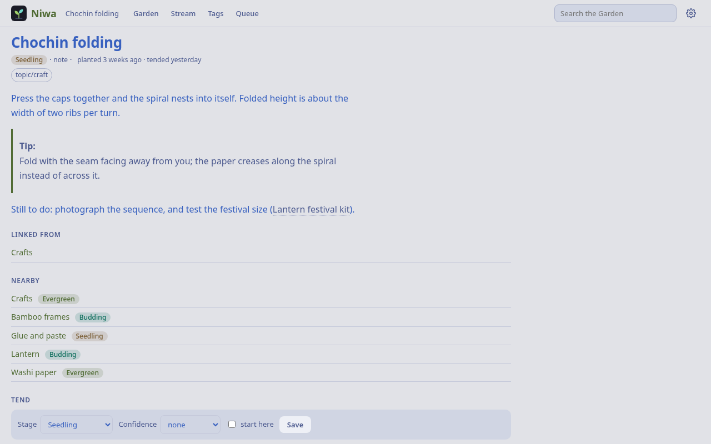
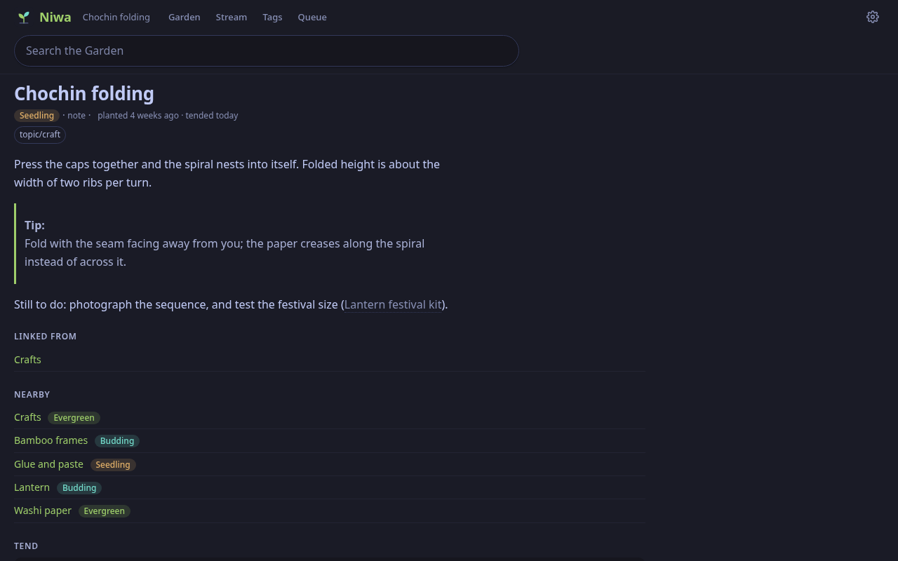
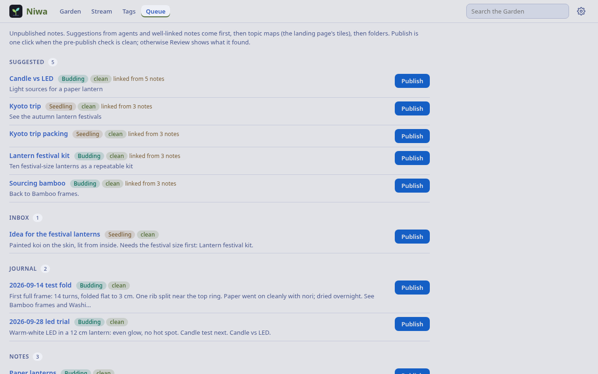
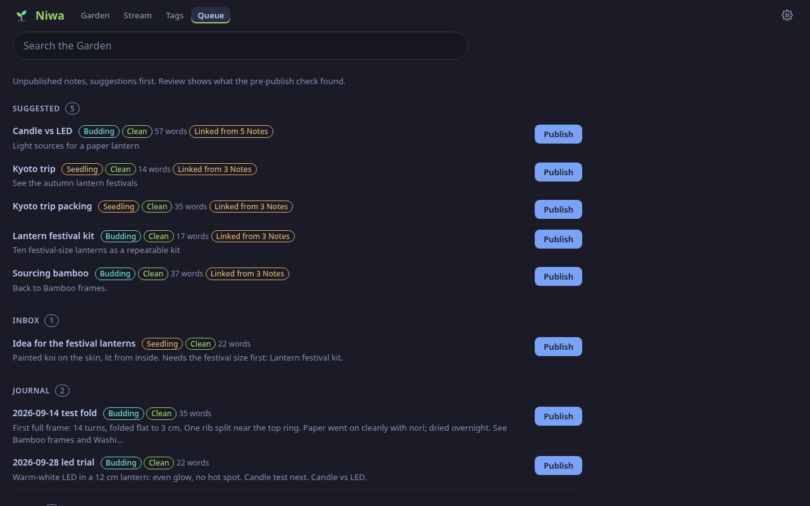
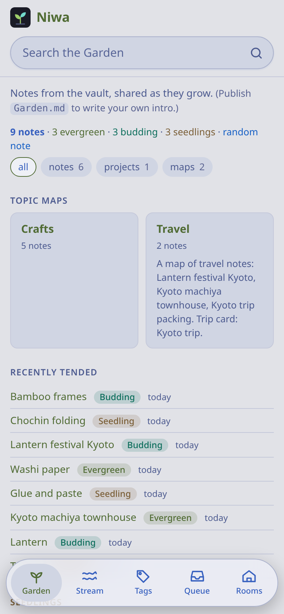
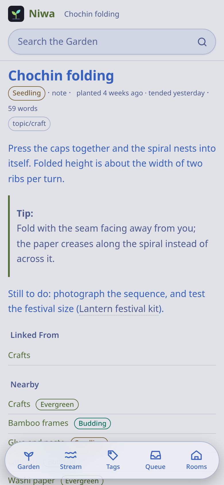

# Niwa 庭

**The private digital garden: the published notes of the vault**, on the web, gemini and gopher. A note is in the garden when its frontmatter has `publish: true`, and only the owner sets that, from Niwa's own buttons.

Niwa is one app of [Machiya](https://github.com/machiya-kobo/machiya), a small set of self-hosted apps that read the same Markdown vault (a Git repo); each app is a **room** (Niwa is the garden). The **owner** is the person whose vault it is: the one who publishes and tends the garden from the web UI.

- **Pages:** the landing page (intro from `Garden.md`, pinned, maps, recent, "in bloom"), notes, tags, the stream (what changed), the queue (suggested and well-linked unpublished notes), random, images, an RSS feed of the published notes (`/feed.xml`), and `/settings` (Appearance, Garden: Link Previews and Offline Copies, Apps, Account when signed in, About; theme and text size follow the person to another device through `/api/prefs`, the rest is per device).
- **Growth stages** (seedling, budding, evergreen), confidence, pins, backlinks, "nearby" notes, and topic maps.
- **Pre-publish scan:** addresses, keys and tokens, links to notes in private folders (`NIWA_PRIVATE_FOLDERS`), links to unpublished notes, dead links, a missing summary.
- **Link rot:** every external link in a published note is checked. A dead link is swapped for its Wayback copy; the owner's pages also get a Hister copy.
- **Small web:** gemini (1965) and gopher (70) mirrors of the garden. They serve published notes only, and their `/stream` lists garden events about published notes and nothing from a board, so nothing about an unpublished note reaches them.

## Quickstart

Niwa alone on your own machine, with the sample vault (a paper-lantern workshop and a trip to Kyoto, nine notes in the
garden): no account, no Tailscale, no identity file. These are the commands for Debian or Ubuntu; other systems and
containers are under "More ways to run it".

**1. Install** Python 3 with venv, `git` and `openssl` (it makes the gemini certificate); `curl` and `nc` are for the
checks below:

<!-- quickstart: packages-debian -->
```bash
sudo apt-get update && sudo apt-get install -y python3-venv git openssl curl netcat-openbsd
```

**2. Clone Niwa** and put `markdown` 3.7 or later and `pyyaml` into a venv in it:

```sh
git clone https://github.com/machiya-kobo/niwa.git && cd niwa
```

<!-- quickstart: venv -->
```bash
python3 -m venv .venv && .venv/bin/pip install -q 'markdown>=3.7' pyyaml
```

**3. Make the sample vault a git repository.** Niwa's publish buttons write to the vault, so it clones a repository
it can push to: here a local bare one, `demo-vault.git`, made from `sample-vault/` (its notes are in `personal/`):

<!-- quickstart: vault -->
```bash
tools/demo-vault demo-vault --bare
mkdir -p demo-data
```

**4. Start it** on `127.0.0.1` with the identity check off (`NIWA_AUTH=open`, for your own machine only):

<!-- quickstart: native-run-debian background -->
```bash
NIWA_AUTH=open NIWA_BIND=127.0.0.1 NIWA_HOST=localhost NIWA_REPO_SUBDIR=personal \
  NIWA_REPO_URL="file://$PWD/demo-vault.git" NIWA_REPO_DIR="$PWD/demo-data/repo" \
  NIWA_DB="$PWD/demo-data/niwa.sqlite3" .venv/bin/python app/niwa.py
```

**5. Open <http://127.0.0.1:8080/>**: nine published notes in three growth stages, topic maps, tags, the stream and the
queue of unpublished notes. Publishing a note there commits to `demo-vault.git` about two minutes after your last change (writes are batched; `git -C demo-vault.git log`). Gemini
is on port 1965 and gopher on 7070. Ctrl-C stops it; `rm -rf demo-vault demo-vault.git demo-data` cleans up.

`tools/quickstart-test` runs these steps (and the container and BSD ones below) from a fresh clone and checks the output.

## Who can use it

- **You, on localhost:** `NIWA_AUTH=open` with `NIWA_BIND=127.0.0.1`, as in the Quickstart: no login, and anyone who
  reaches the web port can publish, so keep it on your own machine.
- **People on your tailnet:** bind `127.0.0.1`, put `tailscale serve` in front, and list their Tailscale logins in
  `NIWA_USERS` (`NIWA_AUTH=tailscale`, the default; `*` = anyone, unset = nobody). `/api/status` is always open.
- **People, agents, sign-in or Shiori devices:** turn on Machiya's identity file with `python3 -m vaultkit.identity setup`,
  which prints the settings for each room. It's off unless you set it; see [Machiya's identity guide](https://github.com/machiya-kobo/machiya/blob/main/docs/identity.md) (needs Python 3.11 or newer: the file is TOML).
- **Hister's users as the one sign-in** (`NIWA_AUTH=hister`, without the identity file; see the Hister sign-in section of
  [Machiya's identity guide](https://github.com/machiya-kobo/machiya/blob/main/docs/identity.md#hister-sign-in-authhister)):
  a browser signed in to Hister is let in, a signed-out page goes to the helper's sign-in and comes back (an API call gets
  `401 {"error": "sign in", "signin": …}`), and a Hister account outside `NIWA_HISTER_USERS` gets 403. When sign-in is
  unavailable (the helper or Hister is down, or Hister's user handling is off) the owner's Tailscale login in `NIWA_USERS`
  gets in with a banner; a caller who is signed out never gets that fallback. `POST /signout` (the Rooms menu's Sign Out)
  ends the Hister session. Off unless you set `NIWA_AUTH=hister`; the settings are under Settings. It trusts the Tailscale login for the fallback, so bind `127.0.0.1` behind `tailscale serve` (or set `NIWA_BIND_BEHIND_PROXY=1` in a sidecar); it refuses to start on a public bind otherwise.
- Niwa's identity settings: `MACHIYA_IDENTITY_FILE`, `NIWA_SIGNIN`, `NIWA_AUTH_HEADER`, `NIWA_BIND_BEHIND_PROXY`,
  `NIWA_ACCEPT_APP_CAPS` and `NIWA_PUBLIC_URL` (under Settings).

## How it uses the vault

Niwa keeps its own read-write clone of the vault (ssh deploy key) and writes only the garden's fields (`publish`, `growth`, `confidence`, `garden_pin`) and its events (`.garden/events/*.jsonl`). Writes are batched into commits by `garden`; vaultkit's GitSync pulls, rebases (a conflicting edit is replayed with a three-way frontmatter merge), and pushes. Its SQLite file holds only link-rot records, which are rebuildable.

Optional:
- **Konbini** adds column badges, "in bloom" and the board half of the stream.
- **Kura** adds owner links to the full note.
- **Hister** adds private link copies and the stream's reading line.

Without them the garden still works; those extras just don't appear.

## More ways to run it

Each starts with the packages for your system installed (below), then a clone with the sample vault made a repository (steps 2 and 3 of the Quickstart; the venv is only for the Debian native run). **You need** `git`,
`curl`, `openssl` and `nc` (netcat), and one of `podman` (4 or newer) or `docker` (24 or newer); the container build pulls
its base images from the internet. Ports 8080 (web), 1965 (gemini) and 7070 (gopher) must be free.

### In a container

*Container with podman* (on Debian or Ubuntu, install it first):

<!-- quickstart: packages-podman-debian -->
```bash
sudo apt-get update && sudo apt-get install -y podman git curl openssl netcat-openbsd
```

<!-- quickstart: container-podman -->
```bash
podman build -q -t niwa-demo app
podman run -d --init --name niwa-demo --userns=keep-id \
  -p 127.0.0.1:8080:8080 -p 127.0.0.1:1965:1965 -p 127.0.0.1:7070:7070 \
  -v "$PWD/demo-data":/data -v "$PWD/demo-vault.git":"$PWD/demo-vault.git" \
  -e NIWA_AUTH=open -e NIWA_HOST=localhost -e NIWA_REPO_SUBDIR=personal \
  -e NIWA_REPO_URL="file://$PWD/demo-vault.git" niwa-demo
```

Rootless podman started over plain ssh (no systemd user session) needs `cgroup_manager = "cgroupfs"` under `[engine]` in
`~/.config/containers/containers.conf`; a desktop login does not.

*Container with docker* (it runs as your own user, so the mounted folders stay yours). On Debian or Ubuntu install docker first
and add yourself to its group (log in again afterwards, or run the next blocks with `sg docker -c '…'`):

<!-- quickstart: packages-docker-debian -->
```bash
sudo apt-get update && sudo apt-get install -y docker.io git curl openssl netcat-openbsd
sudo usermod -aG docker "$USER"
```

<!-- quickstart: container-docker -->
```bash
docker build -q -t niwa-demo app
docker run -d --init --name niwa-demo -u "$(id -u):$(id -g)" \
  -p 127.0.0.1:8080:8080 -p 127.0.0.1:1965:1965 -p 127.0.0.1:7070:7070 \
  -v "$PWD/demo-data":/data -v "$PWD/demo-vault.git":"$PWD/demo-vault.git" \
  -e NIWA_AUTH=open -e NIWA_HOST=localhost -e NIWA_REPO_SUBDIR=personal \
  -e NIWA_REPO_URL="file://$PWD/demo-vault.git" niwa-demo
```

### Natively on the BSDs

Packages only, no pip. Run the install line for your system as root (OpenBSD has `doas` in base; on a fresh FreeBSD or NetBSD use `su -` first, or install `sudo` from packages), then the run block:

<!-- quickstart: packages-openbsd -->
```bash
doas pkg_add python%3 py3-markdown py3-yaml git curl
```

<!-- quickstart: packages-freebsd -->
```bash
sudo pkg install -y python312 py312-sqlite3 py312-markdown py312-pyyaml git-lite curl
sudo ln -sf /usr/local/bin/python3.12 /usr/local/bin/python3
```

<!-- quickstart: packages-netbsd -->
```bash
sudo env PKG_PATH="https://cdn.NetBSD.org/pub/pkgsrc/packages/NetBSD/$(uname -p)/$(uname -r | cut -d_ -f1)/All" \
  /usr/sbin/pkg_add python313 py313-markdown py313-yaml git-base curl
sudo ln -sf /usr/pkg/bin/python3.13 /usr/pkg/bin/python3
```

<!-- quickstart: native-run-bsd background -->
```bash
NIWA_AUTH=open NIWA_BIND=127.0.0.1 NIWA_HOST=localhost NIWA_REPO_SUBDIR=personal \
  NIWA_REPO_URL="file://$PWD/demo-vault.git" NIWA_REPO_DIR="$PWD/demo-data/repo" \
  NIWA_DB="$PWD/demo-data/niwa.sqlite3" ${PYTHON:-python3} app/niwa.py
```

On FreeBSD and NetBSD the packages install `python3.12` or `python3.13`, so the install lines above also link it as
`python3` (OpenBSD's package already does). Without the link, set `PYTHON=python3.12` (FreeBSD) or `PYTHON=python3.13`
(NetBSD) before the run block. `docs/install/bsd.md` in
[machiya-kobo/machiya](https://github.com/machiya-kobo/machiya) is the full guide, with rc.d scripts and the env file.

### Check all three listeners

Whichever way it runs, this checks the web, gemini and gopher listeners (for a native run, in a second terminal in the same folder). The loop waits up to four minutes for the first start (Niwa clones and indexes the vault):

<!-- quickstart: check -->
```bash
i=0; while [ $i -lt 240 ]; do curl -fs http://127.0.0.1:8080/api/status | grep -q '"ready": true' && break; i=$((i+1)); sleep 1; done
curl -s http://127.0.0.1:8080/api/status
curl -s http://127.0.0.1:8080/ | grep -o '<title>[^<]*'
curl -s http://127.0.0.1:8080/n/Projects/Lantern | grep -o '<title>[^<]*'
printf 'gemini://localhost/\r\n' | openssl s_client -connect 127.0.0.1:1965 -quiet -ign_eof 2>/dev/null | head -n 3
printf '\r\n' | nc -w 2 127.0.0.1 7070 | head -n 1
```

You should see the status, the page titles, the gemini capsule and the first line of the gopher menu:

<!-- quickstart-expect: check -->
```text
"published": 9
"ready": true
"error": null
<title>Niwa
<title>Lantern - Niwa
20 text/gemini
# Niwa
NIWA
```

Niwa has no read-only mode: a real vault needs a deploy key with write access (see "Install" below). Stop a container
with:

<!-- quickstart: stop-container-podman -->
```bash
podman rm -f niwa-demo
```

<!-- quickstart: stop-container-docker -->
```bash
docker rm -f niwa-demo
```
A native run stops with Ctrl-C. Then remove the demo files: `rm -rf demo-vault demo-vault.git demo-data`.

The gemini certificate is made on first start with `openssl` (see "The gemini certificate" below). The gopher menus
point at port 70 of `NIWA_HOST` (change it with `NIWA_GOPHER_PUBLIC_PORT`), so a real install maps that port to 7070; the demo's links only work if you map it.

### As part of the Machiya stack

In the stack, Niwa shares the vault with the other apps instead of keeping a second history, and the apps link to
each other. The reference files are in [machiya-kobo/machiya](https://github.com/machiya-kobo/machiya): its README has the
stack's own Quickstart, and `compose/compose.yml` (the engines, Kura, Konbini and Niwa) and `compose/mirror.yml` (the
vault mirror) are the files to start from. What changes for Niwa:

| Setting | In the stack |
|---|---|
| `NIWA_REPO_URL`, `NIWA_REPO_SUBDIR` | the same vault repository and folder as the other apps (a deploy key with write access; Kura only needs read access) |
| `NIWA_REPO_REFERENCE`, `NIWA_REPO_SPARSE` | the vault mirror's path, mounted read-only at the same absolute path, so Niwa borrows its objects instead of fetching a second copy; the folders to check out (`<notes folder>,.garden`) |
| `MACHIYA_COOKIE_DOMAIN`, `MACHIYA_ROOMS` | one cookie domain and the list of room URLs, so the Rooms menu and the theme settings are shared |
| `NIWA_KONBINI_URL`, `NIWA_KURA_URL` | the other rooms' addresses: Konbini adds board badges and its API feeds the owner's stream; Kura adds "View in Kura" links (both optional) |
| `NIWA_AUTH`, `NIWA_USERS`, `NIWA_BIND`, `MACHIYA_IDENTITY_FILE` | who may use it: see "Who can use it" |
| `NIWA_HISTER_URL`, `NIWA_HISTER_TOKEN_FILE`, `NIWA_AUTH=hister` … | the stack's Hister and its token; Hister's users as the sign-in through the stack's hister-login helper (see "Who can use it") |
| `NIWA_KONBINI_TOKEN_FILE` | with the identity file: Niwa's own token for its calls to Konbini (see Settings) |
| `NIWA_ENV_FILE` (or `--env-file`) | a file of `KEY=VALUE` settings, for a native install |
| `MACHIYA_SOURCE_URL` | the address of the source code, to show a "Source code" link as the AGPL asks of a networked service |

## Screenshots

All taken from the sample vault (`tools/screenshots` makes them again).

| Light | Dark |
|---|---|
|  |  |
|  |  |
|  |  |

On a phone (390 px wide):

 

## Install

Niwa needs a Git clone of your vault (Markdown notes with YAML frontmatter) that it can push to: it commits only the garden's fields and its own events.

**Container** (Docker or Podman; the image runs as uid 1000 and keeps everything under `/data`):

```sh
docker build -t niwa app
# HOME is /data: the deploy key (with write access to the vault repo) and known_hosts go in niwa-data/.ssh/
mkdir -p niwa-data/.ssh && cp /path/to/deploy_key niwa-data/.ssh/id_ed25519
ssh-keyscan git.example.net > niwa-data/.ssh/known_hosts
chmod 700 niwa-data/.ssh && chmod 600 niwa-data/.ssh/id_ed25519 && chown -R 1000:1000 niwa-data
docker run -d --name niwa --init --user 1000:1000 \
  -p 127.0.0.1:8080:8080 -p 1965:1965 -p 70:7070 \
  -v "$PWD/niwa-data:/data" \
  -e NIWA_REPO_URL=ssh://git@git.example.net/you/vault.git \
  -e NIWA_REPO_SUBDIR=notes \
  -e NIWA_HOST=garden.example.net \
  -e NIWA_AUTH=open \
  niwa
```

`NIWA_AUTH=open` means no identity check: anyone who can reach the web port can publish and change the garden, so use it for localhost or a trusted LAN only (the example publishes the web port on 127.0.0.1). Gemini and gopher serve only published notes (see SECURITY.md), so their ports can be exposed. For anything else see "Who can use it": with `tailscale` (the default) Niwa trusts the `Tailscale-User-Login` header, which `tailscale serve` sets, and any other reverse proxy works if it sets that header to the signed-in user and strips it from incoming requests.

**Native:** Python 3 with `markdown` (3.7 or later) and `pyyaml`, plus `git`, `openssh` and `openssl`. From `app/`, `python3 -m vaultkit.verify` checks the vendored vaultkit is unedited, and `python3 niwa.py` starts the server. Settings come from the environment, or from a file given with `--env-file PATH` (or `NIWA_ENV_FILE`; the real environment wins).

The web UI is on `NIWA_PORT` (8080); gemini listens on 1965 and gopher on 7070. Gopher menus point at port 70 on `NIWA_HOST` (`NIWA_GOPHER_PUBLIC_PORT`), so map the public port 70 to 7070 as the example does (a rootless Podman needs `net.ipv4.ip_unprivileged_port_start=70` or lower for that). `GET /api/status` is open and reports `ready`.

### The gemini certificate

On first start Niwa asks `openssl` for a self-signed certificate (EC P-256, valid ten years, subject `CN=<NIWA_HOST>`, names `NIWA_HOST` and its first label) and keeps `gemini.crt` and `gemini.key` next to `NIWA_DB`. Gemini clients trust it on first use. It is made once: changing `NIWA_HOST` later keeps the old certificate until you delete both files and restart, and a new certificate makes clients ask again. Keep the data directory (back it up) so the certificate survives rebuilds.

## Settings

| Env | Default | |
|---|---|---|
| `NIWA_REPO_URL` | — | vault repo to clone once (ssh for writes; set `GIT_SSH_COMMAND` for the key). Unset: use `NIWA_REPO_DIR` as it is |
| `NIWA_REPO_DIR` | `/data/repo` | the clone |
| `NIWA_REPO_SUBDIR` | — | the vault folder in the repo that holds the notes. Unset: the repo root |
| `NIWA_REPO_REFERENCE` | — | in the Machiya stack: the stack's vault copy (vault-mirror), mounted read-only at the same absolute path. Niwa borrows its objects (vaultkit `borrow`: alternates, then `repack -a -d -l`, idempotent at start-up), so its clone keeps only its own commits. Unset: standalone, a full clone of its own |
| `NIWA_REPO_SPARSE` | — | with a reference: the paths to check out (cone), e.g. `notes,.garden,.board` (the notes, Niwa's events, older events from a shared board). Unset: everything |
| `NIWA_POLL` | `60` | seconds between pulls |
| `TZ` | `UTC` | the time zone for the stream's days and "this week" counts, e.g. `Europe/Berlin` |
| `NIWA_IGNORE_AUTHORS` | — | comma-separated git author names of bots that commit to the vault: their commits don't count as "tended" in the stream (Niwa's own `NIWA_GIT_NAME` is always ignored) |
| `NIWA_INTRO` | `Notes from the vault, shared as they grow.` | the landing page's intro while no `Garden.md` is published, on the web, gemini and gopher: plain text (HTML-escaped), one line. Publish `Garden.md` to write your own (gemini and gopher show it too) |
| `NIWA_AUTH` | `tailscale` | `tailscale`: the owner's pages and writes need a `Tailscale-User-Login` in `NIWA_USERS`. `open`: no identity check (a startup warning), for localhost or a trusted LAN only; it serves only requests whose `Host` is an IP address, `localhost`, `NIWA_HOST`, `NIWA_PUBLIC_URL`'s host or a name in `NIWA_ALLOWED_HOSTS` (a guard against DNS rebinding), so an HTTP/1.0 client that sends no `Host` header gets 403. `header`: with `MACHIYA_IDENTITY_FILE` only, a trusted proxy's login header (`NIWA_AUTH_HEADER`). `hister`: Hister's sign-in (the row below). Either way, form posts must be same-origin and agents may only suggest. Any other value refuses to start |
| `NIWA_USERS` | — | allowed `Tailscale-User-Login`s; `*` = anyone; unset = nobody (`/api/status` is open) |
| `NIWA_AUTH=hister`, `NIWA_AUTH_URL`, `NIWA_AUTH_SIGNIN_URL`, `NIWA_HISTER_USERS`, `NIWA_AUTH_FALLBACK`, `MACHIYA_COOKIE_DOMAIN`, `MACHIYA_SSO_COOKIE` | — | Hister sign-in (vaultkit's `histerauth`), with `NIWA_PUBLIC_URL` (required) as the way back. `NIWA_AUTH_URL`: the sign-in helper's internal address (`http://hister-login:8081`); unset, Niwa runs on the Tailscale identity alone, with a warning. `NIWA_AUTH_SIGNIN_URL` (required): the helper's public sign-in page. `NIWA_HISTER_USERS` (required, never `*`): the Hister usernames let in. `NIWA_AUTH_FALLBACK`: `tailscale` (the default; `NIWA_USERS` are the logins admitted then, never `*`) or `none` (needs `NIWA_AUTH_URL`; 503 when sign-in is unavailable). `MACHIYA_COOKIE_DOMAIN`: the domain of the shared `machiya_sso` cookie, for clearing it. `MACHIYA_SSO_COOKIE`: the sign-in cookie's name (default `machiya_sso`; letters, digits, `_` and `-`), the same as the hister-login helper's, so a second stack on the same domain can use its own. Refused at start: a missing setting, a `*`, or an identity file at the same time |
| `NIWA_BIND` | `0.0.0.0` | the IPv4 address all three listeners bind (web, gemini, gopher). Behind `tailscale serve` on a native install, bind `127.0.0.1`: on a public bind anyone who reaches the port could send the `Tailscale-User-Login` header |
| `MACHIYA_IDENTITY_FILE` | — | Machiya's identity file (vaultkit's `identity`; [Machiya's `docs/identity.md`](https://github.com/machiya-kobo/machiya/blob/main/docs/identity.md)): people, agents and services with grants. Set, it replaces `NIWA_USERS`: pages and read APIs need the `niwa` `read` grant, `POST /api/suggest` needs `suggest`, and publishing, dismissing and the garden fields need `publish` (the owner has every grant). No or a bad proof (token, login) answers 401, a principal without the grant 403. `/api/status`'s full view is the owner's. Mount the file's **directory** read-only (the CLI replaces the file, and a file mount keeps the old one); with a `session_key_file` beside it. Unset: `NIWA_USERS`, as before |
| `NIWA_SIGNIN` | — | `1`, `on`, `true` or `yes`: with an identity file, the built-in sign-in (vaultkit's `signin`): `/signin` takes a person's name and password (set with `python3 -m vaultkit.identity passwd NAME`) and sets the `machiya_session` cookie (`MACHIYA_COOKIE_DOMAIN` shares it across rooms), alongside any `NIWA_AUTH` mode. A browser without a session then gets a 401 page linking to `/signin`, and Settings shows a Sign Out button. Unset: `/signin` answers 404 (pairing and preferences don't need it) |
| `NIWA_PUBLIC_URL` | — | Niwa's web address, an origin with no path (`https://niwa.example`, `http://192.168.1.5:8080`); anything else refuses to start. With an identity file it is the origin the sign-in, sign-out and a cookie's preference writes accept as same-origin. `http://…` means the web is served over plain http: the session cookie isn't `Secure` (a browser would drop it), and only this origin counts, since over http `Host` and `Origin` prove nothing (DNS rebinding). Unset: https, and the request's own `Host`, over https only; over plain http the sign-in then always refuses. Its host is also served with `NIWA_AUTH=open` |
| `NIWA_AUTH_HEADER` | — | with an identity file and `NIWA_AUTH=header`: the trusted proxy's login header (`Remote-User`, …), matched against each principal's `proxy` logins. `header` without an identity file refuses to start |
| `NIWA_BIND_BEHIND_PROXY` | — | `1`: `NIWA_AUTH=tailscale` or `header` with an identity file, or `NIWA_AUTH=hister` (with the `tailscale` fallback), may bind a non-loopback address because a proxy (the Tailscale sidecar) is the only way into the web port. Without it those modes refuse to start on anything but 127.0.0.1 (plain `NIWA_AUTH=tailscale` without an identity file still starts; bind it to 127.0.0.1 yourself) |
| `NIWA_ACCEPT_APP_CAPS` | — | `1`: with an identity file, a Tailscale tagged node (an agent's machine) is known by the app capability `tailscale serve --accept-app-caps=github.com/machiya-kobo/cap/identity` forwards. Only where Serve (Tailscale v1.92 or later) forwards and strips that header; an older one passes a client's own copy through |
| `NIWA_ALLOWED_HOSTS` | — | with `NIWA_AUTH=open`: more names (comma-separated) the web UI answers to besides IP addresses, `localhost`, `NIWA_HOST` and `NIWA_PUBLIC_URL`'s host, e.g. a LAN name. Names match without case, port or a trailing dot (`Box.lan:8080` is `box.lan`). A request with no `Host` header (an HTTP/1.0 client may send none) gets 403 |
| `NIWA_HOST` | — | the name in the gemini certificate and gopher menus, and the footer's Gemini and Gopher links. Unset: `localhost`, no footer links, and a startup warning |
| `NIWA_PRIVATE_FOLDERS` | — | top-level folders of the notes (comma-separated, e.g. `Private,Inbox`) whose notes are never queued and never published: a note there with `publish: true` is not served on the web, gemini, gopher or the feed, "Publish" refuses it (no "publish anyway"), and the pre-publish check warns about links to them. Unset: no folder is special |
| `NIWA_LINKS_USER_AGENT` | `niwa-links/1` | the link checker's User-Agent (add a contact URL for the sites it checks) |
| `NIWA_SKIP_HOSTS` | — | host names (comma-separated; each matches itself and its subdomains) the link checker never visits, on top of `localhost`, `*.ts.net` and every private, loopback or link-local IP address |
| `NIWA_KONBINI_URL`, `NIWA_KURA_URL` | — | sister services (see above): the addresses browsers follow |
| `NIWA_KONBINI_TOKEN_FILE` | — | a file holding Niwa's service token for Konbini (`python3 -m vaultkit.identity token mint niwa`), sent as `Authorization: Bearer` on every call to Konbini (with `X-Agent: niwa`), so Konbini knows Niwa by its own principal. Never logged. Set to a file with no token, Niwa refuses to start. Unset: no token, as before |
| `NIWA_KONBINI_API_URL` | `NIWA_KONBINI_URL` | the address Niwa's own server calls Konbini on, when it differs from the one browsers use (in a container stack: `http://konbini:8081` inside, `http://localhost:8081` outside) |
| `NIWA_GOPHER_PUBLIC_PORT` | `70` | the port the gopher menus advertise; the listener itself is on 7070, so map the public port to it |
| `MACHIYA_ROOMS` | — | the Rooms switcher, `shiori=https://…,konbini=…,niwa=…,kura=…,hister=…,searxng=…,machiya=…` (the stack sets it; `machiya=` is the stack's landing page: a "Machiya · home" row and the footer's "Part of Machiya" link). Unset: the switcher shows Konbini and Kura from the two settings above, or nothing |
| `MACHIYA_SOURCE_URL` | — | where the source code is published: a "Source code" link in the footer and About, as the AGPL asks of a networked service |
| `NIWA_HISTER_URL`, `NIWA_HISTER_PUBLIC` | — | Hister (optional): the owner's private link copies and the stream's reading line; `NIWA_HISTER_PUBLIC` is the address the owner's browser uses for links to it |
| `NIWA_HISTER_TOKEN_FILE` | — | the file holding the owner's Hister token (first line). Set, it goes to Hister as `X-Access-Token` on every call and to the `hister` command-line tool as `HISTER__APP__ACCESS_TOKEN` in its own environment (never on its command line); it is read again when the file changes, never logged and never shown in `/api/status`. A set file with no token stops startup. Unset: no token is sent, as before (Hister ignores it until it requires one) |
| `NIWA_COLD_MAP` | — | optional: the URL of a JSON map of static page snapshots, `{"urls": {norm(url): {"snapshot", "date"}}}` (keys from `app/urlnorm.py`), used as the owner's private copy of a link |
| `NIWA_ARCHIVE` | `none` | `wayback` asks the Wayback Machine for a snapshot of each link in the published notes (it sends those URLs to archive.org) and swaps a dead link for its snapshot. `none` never contacts archive.org; links are still checked for life and snapshots already recorded still show. Any other value counts as `none`, with a startup warning |
| `NIWA_HISTER_SAVE` | — | `1`, `on` or `true`: link rot may index a live link into Hister when Hister doesn't have it. Unset: Hister is only looked up (the owner's copy is shown), never written to |
| `NIWA_DB` | `/data/niwa.sqlite3` | link records; the gemini certificate and `prefs.sqlite3` (per-user preferences, 0600) sit next to it |
| `NIWA_GIT_NAME`, `NIWA_GIT_EMAIL` | `garden`, `garden@niwa` | commit author |
| `NIWA_PORT` | `8080` | web listener; gemini 1965, gopher 7070 |

## API

- `POST /api/suggest {"path": "Notes/X.md" | "slug", "reason": "…"}`: an agent suggests a note for the garden (the old Konbini path `/api/garden/suggest` also works). 201, or 409 if it's already published.
- `GET /feed.xml`: RSS 2.0 of the published notes, the 50 most recently tended first (title, link, summary; never an unpublished note, the queue, `Archive/` or a private folder). Behind the same gate as the pages; every page links it in its head and footer.
- `GET /api/suggestions[?days=60]`: the open suggestions, newest first (`days` 1 to 365), as `{"suggestions": [{"path", "reason", "agent", "date"}], "days"}`; same access as the pages.
- `GET /api/changelog`: `app/CHANGELOG.md` as `text/markdown` (ETag, 304; 404 without the file), open like `/api/status`, for the stack's landing page.
- `GET /api/status`: version, vaultkit, head, notes, published, sync, konbini, hister, links, ready, error, auth. Open to anyone for monitoring; only the owner sees the Konbini and Hister addresses and their errors, and credentials in a remote URL are never shown.

With an identity file (`MACHIYA_IDENTITY_FILE`), vaultkit's `signin` adds the first three (without one they answer 404):

- `GET /signin[?next=/path]`, `POST /signin`: the built-in sign-in (`NIWA_SIGNIN=1`, else 404). The post is a same-origin form (`name`, `password`, `next`, at most 4 KB); success is 303 to `next` (a local path only) with the session cookie; a wrong name or password 401, too many tries 429.
- `POST /signout`: same-origin only; clears the session cookie, 303 to `/`.
- `POST /api/pair {"code": "ABCD-EFGH", "device": "iPhone"}`: a Shiori device pairs with a one-time code (`python3 -m vaultkit.identity pair NAME --label iPhone`) and gets `{"token": "mcd_…", "principal"}`, its own token to send as `Authorization: Bearer`. No cookie, so no same-origin rule; 401 for an unknown or expired code, 429 when throttled; at most 1 KB.
- `GET /api/prefs`, `PUT /api/prefs {"prefs": {"key": "value" or null}}`: the caller's own preferences (keys `[a-z0-9_.-]`, string values up to 4 KB, 100 keys; `null` removes one), stored in `prefs.sqlite3` next to `NIWA_DB`. Needs the `niwa` `read` grant. A PUT made with a session cookie, a Tailscale or proxy login must be same-origin; one with a token needn't. Without an identity file it is there too: `NIWA_USERS` (or open mode) decides who gets in, and the preferences are the Tailscale login's (stored under a hash of it) or, with `NIWA_AUTH=open`, the one local owner's. Every page then carries `<meta name="machiya-prefs">`, so theme and text size follow the person to another device.

The first three come before the gate (they are how you get past it), after the `NIWA_AUTH=open` `Host` check; `/api/prefs` comes after it. Gemini and gopher have none of them.

Publishing, stages and dismissals are form posts from the owner's pages (same origin only; agents get 403). With an
identity file the power comes from the `niwa` `publish` grant, not from the request's `Origin` or a missing
`X-Agent`: an agent's token gets 403 there whatever it sends. `X-Agent` names the session in the garden's events
(`agent`), and `actor` is the principal. Agents send their token as `Authorization: Bearer mch_…`.

## Layout

- `app/niwa.py` — the server: settings, listeners, routes, forms, sync, status
- `app/garden.py` — the garden over vaultkit's `Vault`: published notes, relations, the pre-publish check, the queue
- `app/gmodern.py` — the pages; `app/feed.py` — `/feed.xml`; `app/shell.py` — Machiya's shared shell (`vaultkit.shell`) as the room `niwa`: header with the Rooms switcher (`MACHIYA_ROOMS`, or Niwa's own Konbini/Kura URLs standing alone), tab bar, footer status line, /settings, PWA
- `app/stream.py` — the stream (garden half here, board half from Konbini)
- `app/smallweb.py` — gemini and gopher
- `app/links.py`, `app/hister.py`, `app/urlnorm.py` — link rot, the Hister client and the URL rule (`urlnorm.py` is the URL rule used to match a note's link to a cold-archive snapshot; Konbini carries an identical copy)
- `app/state.py` — link records and garden events
- `app/writer.py` — the garden's writes
- `app/konbini.py` — the optional board client
- `app/vaultkit/` — **vendored** from machiya-kobo/machiya (`tools/vendor-vaultkit <tag>`; the build fails if it's edited), with the shared UI in `app/vaultkit/ui/` (`machiya.css`, `machiya.js`, served at `/static/`)
- `app/static/` — `niwa.css`/`niwa.js` (the garden's own room, loaded after machiya.css/js), Mermaid (MIT), icons; the service worker is the vendored `app/vaultkit/ui/machiya-sw.js`
- `tests/` — see the test file's docstring

## Licence

Copyright (C) 2026 Micheal Waltz and Machiya contributors.

Niwa is free software: GNU Affero General Public License, version 3 or (at your option) any later version.
See `LICENSE`. Third-party software it ships (Mermaid, the Hister CLI in the image) is listed with its licences in
`THIRD_PARTY_NOTICES`.
`app/urlnorm.py` is the project's own code and ships under the same licence.
